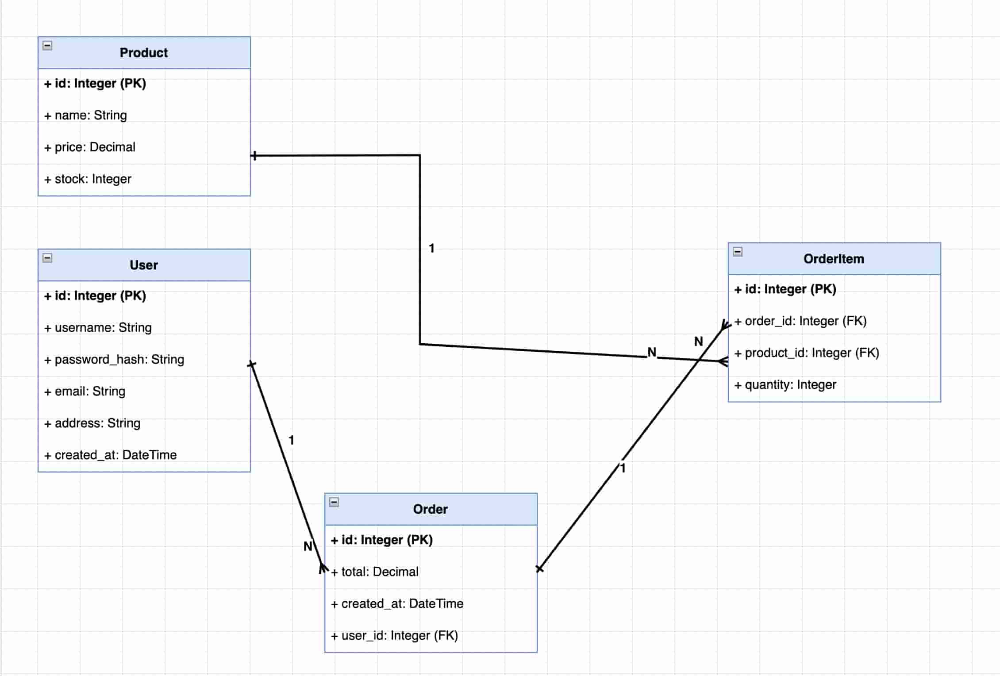
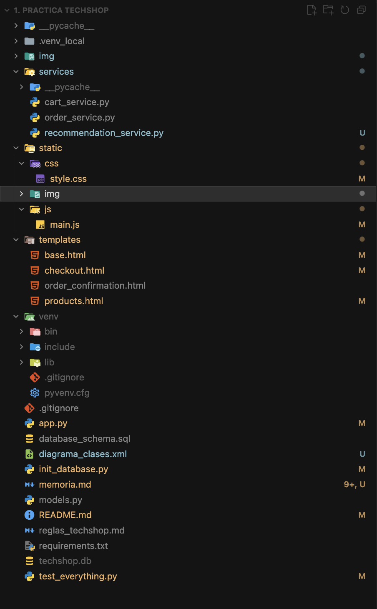
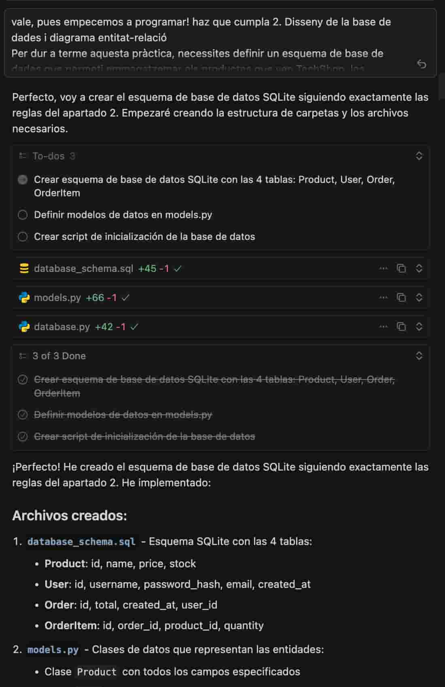
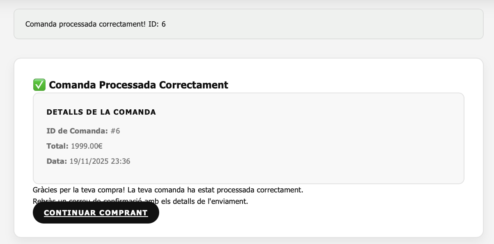

# TechShop – Aplicació Web MVC amb Flask i SQLite

## Memòria de la Pràctica

**Nom de l'alumne/a:** Yago Alonso i Oriol Fontcuberta 
**Assignatura:** Programació d'Intel·ligència Artificial - CIA  
**Data:**  20/11/2025

---

## Índex

1. Introducció i objectius
2. Disseny de la base de dades i model ER
3. Lògica de negoci i rutes
4. Validacions del frontend i estructura del projecte
5. Estructura de carpetes i organització MVC
6. Procés de desenvolupament amb IA
7. Ús de la intel·ligència artificial
8. Resultat final
9. Conclusions

---

## 1. Introducció i objectius de la pràctica

Aquesta pràctica té com a finalitat desenvolupar una aplicació web senzilla per gestionar un carretó de compra per a TechShop, una empresa fictícia que ven productes electrònics en línia.

El projecte permet aplicar els principis d'arquitectura MVC, l'ús de l'arquitectura en tres capes (presentació, lògica de negoci i accés a dades) i la integració d'una base de dades SQLite a través de Flask.

### Objectius principals

* Comprendre la importància de separar responsabilitats entre la vista (front-end), la lògica de negoci i l'accés a dades.
* Dissenyar i implementar una base de dades per gestionar productes, usuaris, comandes i detalls de comanda.
* Crear rutes i serveis a Flask que encapsulin la lògica de negoci sense barrejar-la amb HTML o SQL.
* Aplicar validacions al servidor i al client per garantir la coherència i integritat de les dades.
* Integrar i justificar l'ús d'eines d'intel·ligència artificial durant el procés de desenvolupament.

Aquest document descriu totes les etapes del projecte: disseny del model de dades, definició de rutes, validacions, estructura del projecte i reflexió sobre l'ús d'IA.

---

## 2. Disseny de la base de dades i diagrama entitat–relació

Per donar suport a les funcionalitats bàsiques de TechShop, s'ha creat una base de dades SQLite que conté quatre entitats principals: Product, User, Order i OrderItem.

### 2.1. Taula Product

* `id` (INTEGER, PK, autoincrement)
* `name` (VARCHAR(100))
* `price` (DECIMAL(10,2))
* `stock` (INTEGER)

Gestiona tots els productes disponibles a la botiga.

### 2.2. Taula User

* `id` (INTEGER, PK, autoincrement)
* `username` (VARCHAR(20))
* `password_hash` (VARCHAR(60))
* `email` (VARCHAR(100))
* `address` (TEXT)
* `created_at` (DATETIME)

Permet gestionar el compte de cada usuari que realitza una compra.

### 2.3. Taula Order

* `id` (INTEGER, PK, autoincrement)
* `total` (DECIMAL(10,2))
* `created_at` (DATETIME)
* `user_id` (INTEGER, FK)

Representa una comanda vinculada a un usuari.

### 2.4. Taula OrderItem

* `id` (INTEGER, PK, autoincrement)
* `order_id` (INTEGER, FK)
* `product_id` (INTEGER, FK)
* `quantity` (INTEGER)

Associa una comanda amb els seus productes i quantitats.

### 2.5. Relació entre entitats

* Un User pot tenir moltes Order.
* Cada Order conté molts OrderItem.
* Cada OrderItem correspon exactament a un Product.



---

## 3. Lògica de negoci i rutes (MVC + 3 capes)

La tercera capa del document detalla com s'ha implementat la lògica de negoci i la separació d'arquitectura.

### 3.1. Estructura en tres capes

* **Presentació (templates/)**: només HTML/Jinja.
* **Lògica de negoci (services/)**: gestiona el carretó i les comandes.
* **Accés a dades (models.py)**: definició de models i connexions.

### 3.2. Funcions principals de negoci

#### `add_to_cart(product_id, quantity)`

**Ubicació:** `services/cart_service.py` (líneas 19-50)

**Descripció:** Afegeix un producte al carretó amb validacions.

**Validacions implementades:**

* Comprova que la quantitat sigui un enter positiu (`isinstance(quantity, int) or quantity <= 0`)
* No permet afegir més de 5 unitats del mateix producte: suma la quantitat actual del carretó (`self.cart.get(product_id, 0)`) amb la nova quantitat i verifica que no superi 5
* Valida stock disponible cridant a `validate_stock(product_id, quantity)`

**Retorn:** `Tuple[bool, str]` — `(True, missatge)` si té èxit, `(False, missatge)` si falla

**Excepcions:** No llança excepcions; retorna tuples d'error per a maneig controlat

**Exemple d'ús:**
```python
success, message = cart_service.add_to_cart(1, 3)
if success:
    print(message)  # "Producte afegit al carretó. Quantitat total: 3"
```

#### `remove_from_cart(product_id)`

**Ubicació:** `services/cart_service.py` (líneas 52-66)

**Descripció:** Elimina un producte del carretó sense conèixer detalls de presentació.

**Funcionament:**

* Verifica si el `product_id` existeix al diccionari `self.cart`
* Si existeix, l'elimina amb `del self.cart[product_id]`
* No requereix accés a la base de dades ni a models de presentació

**Retorn:** `Tuple[bool, str]` — `(True, "Producte eliminat del carretó")` si existeix, `(False, "Producte no trobat al carretó")` si no existeix

**Exemple d'ús:**
```python
success, message = cart_service.remove_from_cart(1)
```

#### `validate_stock(product_id, quantity)`

**Ubicació:** `services/cart_service.py` (líneas 68-95)

**Descripció:** Comprova que hi hagi stock suficient a la taula `Product`.

**Funcionament:**

* Consulta la base de dades: `SELECT stock FROM Product WHERE id = ?`
* Compara el stock disponible amb la quantitat sol·licitada
* Retorna error si el stock és insuficient o si el producte no existeix

**Retorn:** `Tuple[bool, str]` — `(True, "Stock disponible")` si hi ha stock suficient, `(False, missatge)` amb detalls de l'error

**Missatges d'error:**

* "Producte no trobat" — si el producte no existeix
* "Stock insuficient. Disponible: X, Sol·licitat: Y" — si no hi ha prou stock
* "Error accedint a la base de dades: {error}" — en cas d'error de base de dades

**Exemple d'ús:**
```python
stock_ok, stock_msg = cart_service.validate_stock(1, 5)
if not stock_ok:
    print(stock_msg)  # "Stock insuficient. Disponible: 3, Sol·licitat: 5"
```

#### `create_order(cart, user_id)`

**Ubicació:** `services/order_service.py` (líneas 19-75)

**Descripció:** Crea una nova comanda quan l'usuari finalitza la compra.

**Funcionalitats implementades:**

1. **Càlcul del total de la compra:**
   * Crida a `_calculate_order_total(cart, cursor)` (líneas 77-97)
   * Suma `price × quantity` per a cada producte del carretó
   * Utilitza `Decimal` per a precisió monetària

2. **Actualització de l'inventari:**
   * Per a cada producte al carretó, executa: `UPDATE Product SET stock = stock - ? WHERE id = ?`
   * Redueix el stock segons la quantitat comprada

3. **Inserció de registres:**
   * Insereix a la taula `Order`: `INSERT INTO "Order" (total, created_at, user_id) VALUES (?, ?, ?)`
   * Insereix a `OrderItem` per a cada producte: `INSERT INTO OrderItem (order_id, product_id, quantity) VALUES (?, ?, ?)`

**Validacions:**

* Verifica que el carretó no estigui buit
* Verifica que l'usuari existeixi a la base de dades
* Maneja errors de base de dades amb transaccions

**Retorn:** `Tuple[bool, str, int]` — `(True, missatge, order_id)` si té èxit, `(False, missatge, 0)` si falla

**Exemple d'ús:**
```python
cart = {1: 2, 3: 1}  # {product_id: quantity}
success, message, order_id = order_service.create_order(cart, user_id=1)
if success:
    print(f"Comanda creada! ID: {order_id}")
```

### 3.3. Rutes principals (controllers/routes.py)

#### `show_products()`

**Ubicació:** `app.py` (líneas 59-107)

**Descripció:** Obté tots els productes i els passa a la vista sense càlculs interns.

**Funcionament:**

* Consulta la base de dades: `SELECT id, name, price, stock FROM Product`
* Crea objectes `Product` amb les dades obtingudes
* Obté imatges de cada producte mitjançant `_get_product_images(product_id)`
* Obté recomanacions mitjançant `recommendation_service.get_top_selling_products(limit=3)` i `recommendation_service.get_top_products_for_user(user_id, limit=3)`
* Passa tota la informació a la plantilla `products.html` sense realitzar càlculs de negoci

**Separació de responsabilitats:**

* No conté lògica de negoci
* No calcula totals ni descomptes
* Només obté dades i les formata per a la vista

**Retorn:** Renderitza la plantilla `products.html` amb els productes, recomanacions i imatges

#### `checkout()`

**Ubicació:** `app.py` (líneas 159-197)

**Descripció:** Mostra el resum del carretó i un formulari d'usuari.

**Funcionament:**

1. Obté el contingut del carretó: `cart_service.get_cart_contents()`
2. Calcula el total del carretó: `cart_service.get_cart_total()`
3. Obté informació dels productes del carretó des de la base de dades
4. Renderitza la plantilla `checkout.html` amb el resum i el formulari

**Si l'usuari confirma:**

* La ruta `process_order()` (líneas 200-272) maneja el POST del formulari
* Valida les dades del formulari (username, password, email, address)
* Crea l'usuari a la base de dades amb contrasenya hashejada
* Invoca `order_service.create_order(cart_contents, user_id)` per a crear la comanda
* Buida el carretó amb `cart_service.clear_cart()`
* Redirigeix a la pàgina de confirmació

**Validacions del servidor:**

* Username: 4-20 caràcters
* Password: mínim 8 caràcters, almenys una lletra i un número
* Email: ha de contenir `@` i un `.` després de l'`@`
* Address: mínim 10 caràcters

### 3.4. Bones pràctiques aplicades

#### Separació de responsabilitats

1. **Cap lògica de negoci a les plantilles:**
   * Les plantilles Jinja2 només mostren dades
   * No hi ha càlculs de preus, totals o validacions a les plantilles
   * Exemple: `{{ "%.2f"|format(product.price * quantity) }}` és només format, no lògica

2. **Cap consulta SQL a les rutes:**
   * Les rutes (`app.py`) delega en serveis
   * Les consultes SQL estan a `CartService`, `OrderService` i `RecommendationService`
   * Les rutes només coordinen entre serveis i vistes

3. **Separació estricta entre controlador i servei:**
   * Controlador (`app.py`): maneja HTTP, sessions, redireccions
   * Serveis (`services/`): contenen la lògica de negoci
   * Models (`models.py`): representen estructures de dades

4. **Docstrings amb validacions i excepcions:**
   * Totes les funcions tenen docstrings amb:
     * Descripció de la funció
     * Args: paràmetres amb tipus
     * Returns: tipus i descripció del retorn
     * Raises: excepcions que poden llançar-se (quan aplica)

**Exemple de docstring complet:**
```python
def add_to_cart(self, product_id: int, quantity: int) -> Tuple[bool, str]:
    """
    Afegir un producte al carretó.
    
    Args:
        product_id (int): ID del producte a afegir
        quantity (int): Quantitat a afegir
        
    Returns:
        Tuple[bool, str]: (èxit, missatge)
        
    Raises:
        ValueError: Si la quantitat no és vàlida o supera el límit
    """
```

---

## 4. Validacions del frontend i estructura del projecte

### 4.1. Validacions del formulari (frontend)

**Ubicació:** `templates/checkout.html` i `static/js/main.js`

El formulari de checkout valida els següents camps:

#### **Username (Nom d'usuari)**

* **Validació HTML:** `minlength="4"`, `maxlength="20"`, `pattern="[a-zA-Z0-9_]+"`
* **Validació JavaScript:** Funció `validateUsername()` (líneas 227-229 de `main.js`)
  * Regex: `/^[a-zA-Z0-9_]{4,20}$/`
  * Només lletres, números i guions baixos
* **Missatge d'error:** "El nom d'usuari ha de tenir entre 4 i 20 caràcters i només pot contenir lletres, números i guions baixos"

#### **Password (Contrasenya)**

* **Validació HTML:** `minlength="8"`, `pattern="^(?=.*[A-Za-z])(?=.*\d).{8,}$"`
* **Validació JavaScript:** Funció `validatePassword()` (líneas 235-237)
  * Mínim 8 caràcters
* **Validació servidor:** També verifica que contingui almenys una lletra i un número (líneas 228-230 de `app.py`)

#### **Email (Correu electrònic)**

* **Validació HTML:** `type="email"`, `pattern="[a-zA-Z0-9._%+-]+@[a-zA-Z0-9.-]+\.[a-zA-Z]{2,}"`
* **Validació JavaScript:** Funció `validateEmail()` (líneas 242-245)
  * Regex: `/^[^\s@]+@[^\s@]+\.[^\s@]+$/`
* **Validació servidor:** Verifica que contingui `@` i un `.` després de l'`@` (líneas 233-235 de `app.py`)

#### **Address (Adreça d'enviament)**

* **Validació HTML:** `minlength="10"`, `maxlength="500"`, `required`
* **Validació JavaScript:** Funció `validateAddress()` (líneas 250-252)
  * Verifica que no estigui buit després de `trim()`
* **Validació servidor:** Mínim 10 caràcters (líneas 238-240 de `app.py`)

#### **Quantitat de productes**

* **Validació HTML:** `input type="number"`, `min="1"`, `max="5"`
* **Validació JavaScript:** Funció `validateQuantityInput()` (líneas 257-271)
  * Verifica que estigui entre 1 i 5
  * Mostra error visual si està fora del rang

#### **Maneig d'errors**

* Els errors es mostren amb `showFieldError()` (líneas 276-288)
* Es mostren sota el camp amb estil vermell
* Es netegen amb `clearFieldError()` (líneas 293-299)
* Els errors no revelen informació interna del sistema

### 4.2. Estructura del projecte

#### **Arxiu: `app.py` (Aplicació principal Flask)**

**Mètodes i funcions:**

1. **`_get_product_images(product_id, limit=4)`** (líneas 29-56)
   * **Descripció:** Construeix les rutes d'imatge per a un producte
   * **Paràmetres:** `product_id` (int), `limit` (int, default=4)
   * **Retorn:** `List[str]` — URLs relatives de les imatges
   * **Funcionament:** Busca imatges a `static/img/products/{product_id}/` amb extensions vàlides (.jpg, .jpeg, .png, .gif, .webp)

2. **`show_products()`** (líneas 59-107) — Ruta `@app.route('/')`
   * Obté productes, recomanacions i imatges
   * Renderitza `products.html`

3. **`add_to_cart()`** (líneas 110-132) — Ruta `@app.route('/add_to_cart', methods=['POST'])`
   * Rep `product_id` i `quantity` del formulari
   * Crida a `cart_service.add_to_cart()`
   * Mostra missatges flash i redirigeix

4. **`remove_from_cart()`** (líneas 135-156) — Ruta `@app.route('/remove_from_cart', methods=['POST'])`
   * Rep `product_id` del formulari
   * Crida a `cart_service.remove_from_cart()`
   * Redirigeix a checkout

5. **`checkout()`** (líneas 159-197) — Ruta `@app.route('/checkout')`
   * Obté contingut i total del carretó
   * Obté informació de productes des de la BD
   * Renderitza `checkout.html`

6. **`process_order()`** (líneas 200-272) — Ruta `@app.route('/process_order', methods=['POST'])`
   * Valida dades del formulari (username, password, email, address)
   * Crea usuari amb `generate_password_hash()`
   * Crida a `order_service.create_order()`
   * Buida el carretó i redirigeix a confirmació

7. **`order_confirmation(order_id)`** (líneas 275-292) — Ruta `@app.route('/order_confirmation/<int:order_id>')`
   * Obté la comanda amb `order_service.get_order_by_id()`
   * Renderitza `order_confirmation.html`

#### **Arxiu: `services/cart_service.py` (Servei del carretó)**

**Classe: `CartService`**

1. **`__init__(db_path="techshop.db")`** (líneas 15-17)
   * Inicialitza el servei amb la ruta de la BD
   * Inicialitza `self.cart = {}` com a diccionari en memòria

2. **`add_to_cart(product_id, quantity)`** (líneas 19-50)
   * Valida quantitat positiva
   * Valida stock amb `validate_stock()`
   * Verifica límit de 5 unitats
   * Actualitza `self.cart[product_id] = total_quantity`

3. **`remove_from_cart(product_id)`** (líneas 52-66)
   * Elimina el producte del diccionari `self.cart`

4. **`validate_stock(product_id, quantity)`** (líneas 68-95)
   * Consulta `SELECT stock FROM Product WHERE id = ?`
   * Compara stock disponible amb quantitat sol·licitada

5. **`get_cart_contents()`** (líneas 97-104)
   * Retorna còpia del diccionari `self.cart`

6. **`clear_cart()`** (líneas 106-108)
   * Buida el diccionari amb `self.cart.clear()`

7. **`get_cart_total()`** (líneas 110-132)
   * Calcula el total sumant `price × quantity` per a cada producte
   * Consulta preus des de la BD
   * Retorna `Decimal` per a precisió monetària

#### **Arxiu: `services/order_service.py` (Servei de comandes)**

**Classe: `OrderService`**

1. **`__init__(db_path="techshop.db")`** (líneas 16-17)
   * Inicialitza el servei amb la ruta de la BD

2. **`create_order(cart, user_id)`** (líneas 19-75)
   * Valida que el carretó no estigui buit
   * Verifica que l'usuari existeixi
   * Calcula total amb `_calculate_order_total()`
   * Insereix a `Order` i `OrderItem`
   * Actualitza inventari: `UPDATE Product SET stock = stock - ? WHERE id = ?`

3. **`_calculate_order_total(cart, cursor)`** (líneas 77-97) — Mètode privat
   * Calcula total sumant `price × quantity` per a cada producte del carretó
   * Utilitza `Decimal` per a precisió

4. **`get_order_by_id(order_id)`** (líneas 99-131)
   * Consulta la comanda des de la BD
   * Retorna objecte `Order` amb les dades

#### **Arxiu: `services/recommendation_service.py` (Servei de recomanacions)**

**Classe: `RecommendationService`**

1. **`__init__(db_path="techshop.db")`** (líneas 16-23)
   * Inicialitza el servei amb la ruta de la BD

2. **`get_top_selling_products(limit=3)`** (líneas 25-68)
   * **Descripció:** Obté els productes més venuts globalment
   * **Consulta SQL:** Agrupa per `product_id`, suma `quantity` de `OrderItem`, ordena per total venut descendent
   * **Retorn:** `List[Tuple[Product, int]]` — Llista de tuples (producte, quantitat venuda)

3. **`get_top_products_for_user(user_id, limit=3)`** (líneas 70-116)
   * **Descripció:** Obté els productes més venuts per a un usuari específic
   * **Consulta SQL:** Filtra per `user_id` a `Order`, agrupa i ordena igual que el mètode anterior
   * **Retorn:** `List[Tuple[Product, int]]` — Llista de tuples (producte, quantitat venuda per l'usuari)

#### **Arxiu: `models.py` (Models de dades)**

**Classes de model:**

1. **`Product`** (líneas 11-22)
   * Atributs: `id`, `name`, `price` (Decimal), `stock`
   * Mètode `__repr__()` per a representació

2. **`User`** (líneas 25-38)
   * Atributs: `id`, `username`, `password_hash`, `email`, `created_at`
   * Mètode `__repr__()` per a representació

3. **`Order`** (líneas 41-52)
   * Atributs: `id`, `total` (Decimal), `created_at`, `user_id`
   * Mètode `__repr__()` per a representació

4. **`OrderItem`** (líneas 55-66)
   * Atributs: `id`, `order_id`, `product_id`, `quantity`
   * Mètode `__repr__()` per a representació

#### **Arxiu: `static/js/main.js` (JavaScript del frontend)**

**Funcions principals:**

1. **`validateCheckoutForm()`** (líneas 181-222)
   * Valida tots els camps del formulari de checkout
   * Crida a funcions específiques de validació
   * Mostra errors amb `showFieldError()`

2. **`validateUsername(username)`** (líneas 227-229)
   * Valida amb regex `/^[a-zA-Z0-9_]{4,20}$/`

3. **`validatePassword(password)`** (líneas 235-237)
   * Verifica longitud mínima de 8 caràcters

4. **`validateEmail(email)`** (líneas 242-245)
   * Valida amb regex `/^[^\s@]+@[^\s@]+\.[^\s@]+$/`

5. **`validateAddress(address)`** (líneas 250-252)
   * Verifica que no estigui buit després de `trim()`

6. **`validateQuantityInput(input)`** (líneas 257-271)
   * Valida que la quantitat estigui entre `min` i `max` de l'input

7. **`showFieldError(field, message)`** (líneas 276-288)
   * Crea i mostra un div d'error sota el camp

8. **`clearFieldError(field)`** (líneas 293-299)
   * Elimina el missatge d'error del camp

9. **Event listeners:**
   * Carrusel de tendències (líneas 23-69)
   * Galeria de productes (líneas 72-122)
   * Animació d'afegir al carretó (líneas 124-175)

#### **Arxiu: `init_database.py` (Inicialització de la base de dades)**

**Funcions:**
* Crea les taules: `Product`, `User`, `Order`, `OrderItem`
* Insereix dades d'exemple (productes, usuaris, comandes)

### 4.3. Proves amb `test_everything.py`

**Arxiu:** `test_everything.py`

**Descripció:** Script de proves exhaustiu que valida totes les funcionalitats del sistema.

**Estructura:**
* **Sistema de colors:** Classe `Colors` per a output en terminal
* **Funcions auxiliars:** `run_test()`, `assert_true()`, `assert_false()`, `assert_equals()`
* **Base de dades de prova:** Crea `test.db` per a proves aïllades

**Proves implementades (33 en total):**

1. **Proves de models:**
   * `test_product()` — Model Product
   * `test_user()` — Model User
   * `test_order()` — Model Order
   * `test_orderitem()` — Model OrderItem

2. **Proves del carretó:**
   * `test_cart_add()` — Afegir producte
   * `test_cart_stock()` — Stock insuficient
   * `test_cart_limit()` — Límit de 5 unitats
   * `test_cart_negative()` — Quantitat negativa
   * `test_cart_remove()` — Eliminar producte
   * `test_cart_remove_nonexistent()` — Eliminar producte inexistent
   * `test_cart_contents()` — Obtindre contingut
   * `test_cart_total()` — Calcular total
   * `test_cart_clear()` — Buidar carretó

3. **Proves de comandes:**
   * `test_order_create()` — Crear comanda
   * `test_order_empty_cart()` — Carretó buit
   * `test_order_total()` — Calcular total de comanda
   * `test_order_get()` — Obtindre comanda per ID
   * `test_order_get_nonexistent()` — Comanda inexistent
   * `test_inventory_update()` — Actualitzar inventari

4. **Proves de validacions:**
   * `test_username_validation()` — Validació de username
   * `test_password_length()` — Longitud de contrasenya
   * `test_password_complexity()` — Complexitat de contrasenya
   * `test_email_validation()` — Validació de email
   * `test_address_validation()` — Validació d'adreça
   * `test_required_fields()` — Camps obligatoris
   * `test_password_hash()` — Generar hash de contrasenya
   * `test_password_verify()` — Verificar hash de contrasenya

5. **Proves de recomanacions:**
   * `test_recommendations_by_sales()` — Ordenar per vendes
   * `test_recommendations_limit_zero()` — Límit zero
   * `test_recommendations_no_sales()` — Sense vendes
   * `test_recommendations_for_user()` — Recomanacions per usuari
   * `test_recommendations_user_without_orders()` — Usuari sense compres

**Execució:**
```bash
python test_everything.py
```

**Sortida:**
* Mostra cada prova amb el seu estat (✅ PASSED / ❌ FAILED)
* Resum final amb total de proves, exitoses, fallides i percentatge d'èxit
* Neteja la base de dades de prova al finalitzar

**Ús en el projecte:**
* Totes les funcionalitats es van provar amb aquest script
* Verifica que les validacions, límits i lògica de negoci funcionin correctament
* Assegura que els serveis (`CartService`, `OrderService`, `RecommendationService`) compleixin amb els requisits

### 4.4. Resum de l'arquitectura

**Separació de capes:**
1. **Capa de presentació:** Templates HTML + JavaScript (`templates/`, `static/js/`)
2. **Capa de control:** Rutes Flask (`app.py`)
3. **Capa de servei:** Lògica de negoci (`services/`)
4. **Capa de model:** Estructures de dades (`models.py`)
5. **Capa de dades:** Base de dades SQLite (`techshop.db`)

**Principis aplicats:**
* Single Responsibility Principle (SRP)
* Separation of Concerns (SoC)
* DRY (Don't Repeat Yourself)
* Validacions en múltiples capes (frontend + backend)

**Testing:**
* Script de proves exhaustiu (`test_everything.py`) amb 33 proves
* Cobertura de funcionalitats principals
* Proves aïllades amb base de dades de prova

Aquesta estructura facilita el manteniment, l'escalabilitat i la prova del sistema.

---

## 5. Estructura de carpetes i organització MVC

L'estructura del projecte TechShop reflecteix clarament l'arquitectura MVC i la separació en tres capes (presentació, lògica de negoci i accés a dades) requerida per l'enunciat de la pràctica. Aquesta secció descriu l'organització física del projecte i com cada carpeta i arxiu contribueix a mantenir la separació de responsabilitats.



### 5.1. Estructura general del projecte

El projecte segueix una estructura jeràrquica clara que separa les diferents capes de l'aplicació:

```
TechShop/
├── __pycache__/          # Cache de Python (generat automàticament)
├── img/                  # Imatges de documentació
├── services/             # Capa de lògica de negoci (Serveis)
├── static/               # Recursos estàtics (Capa de presentació)
├── templates/            # Plantilles HTML (Capa de presentació)
├── venv/                 # Entorn virtual de Python
├── app.py                # Controlador principal (Rutes Flask)
├── database_schema.sql   # Esquema de la base de dades
├── diagrama_clases.xml   # Diagrama de classes en XML
├── init_database.py      # Script d'inicialització de la BD
├── memoria.md            # Documentació de la pràctica
├── models.py             # Models de dades (Capa de dades)
├── README.md             # Instruccions del projecte
├── reglas_techshop.md    # Regles proporcionades a la IA
├── requirements.txt      # Dependències del projecte
├── techshop.db           # Base de dades SQLite
└── test_everything.py    # Script de proves
```

### 5.2. Capa de presentació (Vista - MVC)

#### **Carpeta `templates/`**

Aquesta carpeta conté totes les plantilles HTML que formen la capa de presentació de l'aplicació. Seguint el principi de separació de responsabilitats, aquestes plantilles només contenen HTML i sintaxi Jinja2 per a la visualització de dades, sense cap lògica de negoci ni accés directe a la base de dades.

* **`base.html`**: Plantilla base que defineix l'estructura general de totes les pàgines (header, footer, navegació).
* **`products.html`**: Pàgina principal que mostra tots els productes disponibles amb les seves imatges, preus i stock.
* **`checkout.html`**: Pàgina de checkout que mostra el resum del carretó i el formulari de dades de l'usuari.
* **`order_confirmation.html`**: Pàgina de confirmació que mostra els detalls de la comanda realitzada.

#### **Carpeta `static/`**

Aquesta carpeta conté tots els recursos estàtics de l'aplicació (CSS, JavaScript i imatges) que són servits directament pel servidor Flask sense processament.

**`static/css/`**
* **`style.css`**: Fitxer d'estils CSS que defineix l'aparença visual de tota l'aplicació, incloent estils per a productes, formularis, botons i animacions.

**`static/js/`**
* **`main.js`**: Fitxer JavaScript que conté tota la lògica del client:
  * Validacions en temps real del formulari de checkout
  * Funcions de validació per a cada camp (username, password, email, address, quantitat)
  * Gestió del carrusel de recomanacions
  * Galeries d'imatges de productes
  * Animacions d'afegir productes al carretó
  * Maneig d'errors i missatges d'usuari

**`static/img/`**
* **`carrito/`**: Conté la imatge de l'icona del carretó de compra (`1.png`).
* **`products/`**: Estructura organitzada per producte:
  * Cada producte té la seva pròpia carpeta numerada per ID (1, 2, 3, ..., 10)
  * Dins de cada carpeta hi ha les imatges del producte numerades (1.png, 2.png, 3.png, 4.png)
  * La primera imatge (la més petita) és la que es mostra inicialment a la web
  * Les imatges poden tenir diferents formats (.png, .jpg, .webp) segons el producte

### 5.3. Capa de control (Controlador - MVC)

#### **Arxiu `app.py`**

Aquest arxiu conté el controlador principal de l'aplicació Flask. Defineix totes les rutes HTTP i coordina entre la capa de presentació i la capa de lògica de negoci. Seguint els principis MVC:

* **No conté lògica de negoci**: Tota la lògica està delegada als serveis de la carpeta `services/`
* **No conté consultes SQL directes**: Totes les consultes estan encapsulades als serveis
* **Només coordina**: Les rutes obtenen dades dels serveis i les passen a les plantilles

Les rutes principals són:
* `@app.route('/')` - Mostra tots els productes
* `@app.route('/add_to_cart', methods=['POST'])` - Afegeix producte al carretó
* `@app.route('/remove_from_cart', methods=['POST'])` - Elimina producte del carretó
* `@app.route('/checkout')` - Mostra el resum del carretó
* `@app.route('/process_order', methods=['POST'])` - Processa la comanda
* `@app.route('/order_confirmation/<int:order_id>')` - Mostra la confirmació

### 5.4. Capa de lògica de negoci (Serveis)

#### **Carpeta `services/`**

Aquesta carpeta conté tots els serveis que encapsulen la lògica de negoci de l'aplicació. Cada servei és responsable d'una funcionalitat específica i no depèn de la capa de presentació ni de detalls d'implementació de la base de dades.

**`services/cart_service.py`**
* **Classe `CartService`**: Gestiona totes les operacions relacionades amb el carretó de compra:
  * Afegir productes amb validació de stock i límits
  * Eliminar productes
  * Validar stock disponible
  * Calcular totals del carretó
  * Gestionar l'estat del carretó en memòria

**`services/order_service.py`**
* **Classe `OrderService`**: Gestiona totes les operacions relacionades amb les comandes:
  * Crear noves comandes
  * Calcular totals de comandes
  * Actualitzar l'inventari després d'una compra
  * Obtenir detalls de comandes existents

**`services/recommendation_service.py`**
* **Classe `RecommendationService`**: Gestiona el sistema de recomanacions:
  * Obtenir productes més venuts globalment
  * Obtenir recomanacions personalitzades per usuari
  * Basat en dades històriques de vendes

**`services/__pycache__/`**
* Carpeta generada automàticament per Python que conté el bytecode compilat dels mòduls per millorar el rendiment.

### 5.5. Capa de dades (Model - MVC)

#### **Arxiu `models.py`**

Aquest arxiu defineix les classes de model que representen les entitats de la base de dades. Cada classe correspon a una taula de la base de dades i proporciona una representació orientada a objectes de les dades:

* **`Product`**: Representa un producte amb els seus atributs (id, name, price, stock)
* **`User`**: Representa un usuari amb les seves dades (id, username, password_hash, email, address, created_at)
* **`Order`**: Representa una comanda (id, total, created_at, user_id)
* **`OrderItem`**: Representa un element d'una comanda (id, order_id, product_id, quantity)

#### **Arxiu `database_schema.sql`**

Conté l'esquema SQL complet de la base de dades amb les definicions de totes les taules (Product, User, Order, OrderItem) i les seves relacions.

#### **Arxiu `diagrama_clases.xml`**

Conté el diagrama de classes en format XML que representa visualment les entitats i les seves relacions.

#### **Arxiu `init_database.py`**

Script d'inicialització que crea la base de dades SQLite, crea totes les taules i insereix dades d'exemple per a proves i demostració.

#### **Arxiu `techshop.db`**

Base de dades SQLite que emmagatzema tots els productes, usuaris, comandes i detalls de comanda de l'aplicació.

### 5.6. Arxius de configuració i documentació

#### **Arxiu `requirements.txt`**

Llista totes les dependències del projecte Python necessàries per executar l'aplicació (Flask, etc.).

#### **Arxiu `README.md`**

Conté les instruccions per executar l'aplicació, les dependències necessàries i captures de pantalla de les funcionalitats principals.

#### **Arxiu `reglas_techshop.md`**

Document que conté les regles estrictes proporcionades a la intel·ligència artificial durant el desenvolupament per assegurar que el codi generat respectés l'arquitectura MVC i les tres capes.

#### **Arxiu `memoria.md`**

Aquest document que descriu tot el procés de desenvolupament, l'arquitectura implementada i l'ús de la intel·ligència artificial.

### 5.7. Arxius de proves i entorn

#### **Arxiu `test_everything.py`**

Script de proves exhaustiu que valida totes les funcionalitats del sistema amb 33 proves que cobreixen:
* Models de dades
* Funcionalitats del carretó
* Creació de comandes
* Validacions
* Sistema de recomanacions

#### **Carpeta `venv/`**

Conté l'entorn virtual de Python amb totes les dependències instal·lades. Aquesta carpeta permet aïllar les dependències del projecte del sistema operatiu.

**Estructura de `venv/`:**
* **`bin/`**: Scripts executables (python, pip, flask, etc.)
* **`lib/`**: Llibreries instal·lades (Flask, Jinja2, Werkzeug, etc.)
* **`include/`**: Headers de C per a extensions
* **`pyvenv.cfg`**: Configuració de l'entorn virtual

#### **Carpeta `__pycache__/`**

Carpeta generada automàticament per Python al directori arrel que conté el bytecode compilat dels mòduls principals per millorar el rendiment.

#### **Carpeta `img/`**

Conté les imatges utilitzades en la documentació de la memòria:
* `estructura.png` - Captura de pantalla de l'estructura del projecte
* `pagina_principal.png` - Captura de la pàgina principal
* `carreto.png` - Captura del carretó
* `validacio.png` - Captura de les validacions
* `confirmacio.png` - Captura de la confirmació
* `entitat.png` - Diagrama entitat-relació
* `prompt1.png` i `prompt2.png` - Captures dels prompts a la IA

### 5.8. Relació entre l'estructura i l'arquitectura MVC

L'estructura de carpetes reflecteix perfectament l'arquitectura MVC i la separació en tres capes requerida per l'enunciat:

**Capa de Presentació (Vista):**
* `templates/` - Plantilles HTML
* `static/css/` - Estils CSS
* `static/js/` - Lògica del client
* `static/img/` - Recursos gràfics

**Capa de Control (Controlador):**
* `app.py` - Rutes Flask que coordinen entre vista i serveis

**Capa de Lògica de Negoci:**
* `services/` - Serveis que encapsulen la lògica de negoci

**Capa d'Accés a Dades (Model):**
* `models.py` - Classes que representen les entitats
* `database_schema.sql` - Esquema de la base de dades
* `techshop.db` - Base de dades SQLite
* `init_database.py` - Script d'inicialització

Aquesta organització assegura que:
1. **No hi ha barreja de responsabilitats**: Cada carpeta té un propòsit clar i específic
2. **Facilita el manteniment**: És fàcil trobar i modificar codi relacionat amb una funcionalitat específica
3. **Permet escalabilitat**: Es poden afegir nous serveis, plantilles o models sense afectar la resta
4. **Segueix estàndards**: L'estructura és consistent amb les bones pràctiques de Flask i MVC

---

## 6. Procés de desenvolupament amb IA

Aquesta secció descriu el procés de desenvolupament del projecte TechShop, detallant com s'ha utilitzat la intel·ligència artificial com a assistent durant totes les etapes del desenvolupament.

### 6.1. Fase inicial: Prompt inicial i definició del projecte

En la primera fase del desenvolupament, es va proporcionar a la IA un prompt inicial complet que contenia totes les regles i requisits del projecte TechShop. Aquest prompt inicial (que es mostra a la **Figura 1**) incloïa:

* Definició completa de l'objectiu del projecte
* Requisits de l'arquitectura MVC i separació en tres capes
* Especificacions de la base de dades (taules Product, User, Order, OrderItem)
* Regles estrictes de separació de responsabilitats
* Validacions requerides tant al frontend com al backend

Aquest prompt inicial va servir com a base per a tot el desenvolupament posterior, assegurant que la IA tingués sempre present tots els requisits i restriccions del projecte.


### 6.2. Segona fase: Creació de l'esquema de base de dades

Després del prompt inicial, es va procedir a la creació de l'esquema de base de dades SQLite. En aquesta fase (mostrada a la **Figura 2**), la IA va generar:

* L'arxiu `database_schema.sql` amb les definicions de les quatre taules principals
* Les classes de models a `models.py` que representen les entitats de la base de dades
* El script d'inicialització `init_database.py` per crear i poblar la base de dades

Aquesta fase va ser crucial per establir els fonaments del projecte, assegurant que l'estructura de dades fos correcta des del principi.



### 6.3. Tercera fase: Desenvolupament per apartats

Un cop establerta la base de dades, el desenvolupament es va continuar demanant a la IA la implementació de funcionalitats específiques per apartats, seguint l'estructura de la memòria:

1. **Apartat 2 - Base de dades:** Es va completar l'esquema i es van crear els models de dades
2. **Apartat 3 - Lògica de negoci:** Es van implementar els serveis (`CartService`, `OrderService`) i les rutes Flask
3. **Apartat 4 - Validacions:** Es van afegir les validacions tant al frontend (JavaScript) com al backend (Python)
4. **Apartat 5 - Recomanacions:** Es va implementar el servei de recomanacions basat en vendes històriques

Aquest enfocament incremental va permetre:
* Revisar cada funcionalitat abans de passar a la següent
* Assegurar que cada part complia amb les regles establertes
* Mantenir la separació de responsabilitats en cada etapa
* Validar que el codi generat seguia les bones pràctiques

### 6.4. Quarta fase: Desenvolupament visual i interfície d'usuari

Un cop completada la lògica de negoci i les validacions, es va passar a la fase de desenvolupament visual. En aquesta etapa, la IA va ajudar a:

* Crear les plantilles HTML (`products.html`, `checkout.html`, `order_confirmation.html`)
* Implementar els estils CSS per a una interfície moderna i atractiva
* Afegir funcionalitats JavaScript per a la interacció de l'usuari:
  * Validacions en temps real del formulari
  * Galeries d'imatges de productes
  * Carrusel de recomanacions
  * Animacions d'afegir productes al carretó

Aquesta fase va ser especialment important perquè va transformar una aplicació funcional però bàsica en una experiència d'usuari completa i professional.

### 6.5. Ús de `test_everything.py` per validar el desenvolupament

Durant tot el procés de desenvolupament, es va utilitzar el script `test_everything.py` per validar que cada funcionalitat implementada funcionava correctament. Aquest script de proves exhaustiu va permetre:

* Verificar que les validacions funcionaven com s'esperava
* Assegurar que els límits (com el de 5 unitats per producte) es respectaven
* Validar que la lògica de negoci estava correctament implementada
* Detectar errors abans de passar a la següent fase

### 6.6. Reflexió sobre el procés

El desenvolupament per fases ha permès mantenir un control estricte sobre la qualitat del codi i assegurar que cada component complia amb els requisits abans de continuar. L'ús de la IA com a assistent ha accelerat significativament el desenvolupament, però sempre sota supervisió humana i amb revisió crítica de tot el codi generat.

Cada fase ha estat revisada i validada abans de passar a la següent, assegurant que el producte final compleix amb tots els requisits especificats al prompt inicial.

---

## 7. Ús de la intel·ligència artificial

Durant el desenvolupament de la pràctica s'ha utilitzat IA com a suport per generar codi, revisar-lo i optimitzar-lo. El seu ús ha estat controlat i justificat, aplicant criteri crític i supervisant totes les propostes generades.

### 7.1. Exemples d'ús d'IA

* Generar esbossos d'estructura de serveis amb patró MVC.
* Validar que els serveis respectin el límit de 5 unitats per producte.
* Revisió de possibles problemes de seguretat (inputs no validades).
* Suggeriments per millorar modularitat i arquitectura.
* Generació de funcions de validació per al frontend.
* Creació de docstrings completes per a totes les funcions.
* Optimització de consultes SQL i estructuració de la base de dades.

### 7.2. Regles estrictes proporcionades a la IA

* No barrejar HTML amb SQL.
* Tots els accessos a BD només des de models o repositoris.
* Respectar el límit de 5 unitats per producte.
* Validar totes les dades rebudes del client abans de processar-les.
* Separació estricta entre capa de presentació, lògica de negoci i accés a dades.
* Totes les funcions han de tenir docstrings amb tipus i descripcions.
* Utilitzar `Decimal` per a càlculs monètaris per evitar errors de precisió.

### 7.3. Reflexió personal

La IA ha estat útil per accelerar tasques repetitives, generar referències de codi i proporcionar consells de bones pràctiques. No obstant això, s'ha utilitzat de manera responsable, revisant tots els resultats i adaptant-los a les necessitats reals del projecte.

La seva limitació principal és que pot generar codi no funcional o massa genèric si no se li donen instruccions extremadament precises. També requereix una supervisió constant per assegurar que el codi generat segueixi els estàndards del projecte i compleixi amb tots els requisits especificats.

L'ús d'IA ha permès:
* Reduir el temps de desenvolupament en tasques repetitives
* Obtenir suggeriments de millores arquitectòniques
* Generar codi de referència que després s'ha adaptat i millorat
* Revisar possibles errors de seguretat i validació

Però sempre s'ha mantingut el control humà sobre:
* La decisió final sobre què implementar
* La revisió i validació de tot el codi generat
* L'adaptació del codi a les necessitats específiques del projecte
* La comprensió completa del funcionament del sistema

---

## 8. Resultat final


### 8.1. Pàgina principal de productes

La pàgina principal mostra tots els productes disponibles a la botiga, amb les seves imatges, preus i stock disponible. També inclou seccions de recomanacions basades en vendes globals i recomanacions personalitzades per a l'usuari.


### 8.2. Detall de producte i afegir al carretó

Cada producte mostra una galeria d'imatges que l'usuari pot explorar passant el ratolí sobre les miniatures. El formulari d'afegir al carretó valida que la quantitat estigui entre 1 i 5 unitats.


### 8.3. Pàgina de checkout

La pàgina de checkout mostra el resum del carretó amb tots els productes seleccionats, les quantitats i els preus. Inclou un formulari complet de validació per a les dades de l'usuari.


### 8.4. Validacions del formulari

El formulari de checkout implementa validacions tant al frontend (JavaScript) com al backend (Python), mostrant missatges d'error clars i específics per a cada camp.


### 8.5. Confirmació de comanda

Després de processar la comanda, l'usuari rep una pàgina de confirmació amb el detall de la comanda realitzada, incloent el número de comanda i el total pagat.




### 8.6. Funcionalitats addicionals

A més de les funcionalitats bàsiques, el projecte inclou:

* **Sistema de recomanacions:** Basat en vendes històriques, mostra productes populars i recomanacions personalitzades
* **Animacions:** Efectes visuals quan s'afegeixen productes al carretó
* **Galeries d'imatges:** Cada producte pot tenir múltiples imatges que l'usuari pot explorar
* **Validacions en temps real:** El formulari valida els camps mentre l'usuari escriu

Totes aquestes funcionalitats contribueixen a crear una experiència d'usuari completa i professional.

---

## 9. Conclusions

Aquesta pràctica ha permès assolir els objectius plantejats inicialment, aplicant de manera pràctica l'arquitectura MVC i la separació en tres capes utilitzant Flask i SQLite. A continuació es presenta una reflexió sobre l'assoliment de cada objectiu específic de la pràctica.

### 8.1. Assoliment dels objectius de la pràctica

#### Objectiu 1: Comprendre la importància de separar responsabilitats entre la vista, la lògica de negoci i l'accés a dades

Aquest objectiu s'ha assolit completament mitjançant l'estructuració del projecte en tres capes ben definides:

* **Capa de presentació (`templates/`, `static/`):** Conté únicament HTML, CSS i JavaScript per a la visualització i interacció amb l'usuari. No hi ha cap lògica de negoci ni accés a dades en aquesta capa.

* **Capa de lògica de negoci (`services/`):** Els serveis `CartService`, `OrderService` i `RecommendationService` encapsulen tota la lògica de negoci sense conèixer detalls de presentació ni d'accés a dades directament.

* **Capa d'accés a dades (`models.py`):** Defineix les estructures de dades i les consultes a la base de dades estan encapsulades dins dels serveis.

Aquesta separació ha facilitat el manteniment del codi i ha permès modificar una capa sense afectar les altres, demostrant la importància d'aquest principi arquitectònic.

#### Objectiu 2: Dissenyar i implementar una base de dades senzilla per gestionar productes, comandes i detalls de comanda

S'ha dissenyat i implementat una base de dades SQLite amb quatre taules principals que cobreixen tots els requisits:

* **Taula `Product`:** Gestiona tots els productes disponibles amb els seus preus i stock.
* **Taula `User`:** Emmagatzema la informació dels usuaris que realitzen compres.
* **Taula `Order`:** Representa les comandes vinculades als usuaris.
* **Taula `OrderItem`:** Relaciona les comandes amb els productes i les seves quantitats.

El diagrama entitat-relació (mostrat a la secció 2) il·lustra clarament les relacions entre les entitats, i l'esquema implementat permet gestionar totes les funcionalitats requerides de manera eficient.

#### Objectiu 3: Crear rutes i serveis a Flask que encapsulin la lògica de negoci sense barrejar codi de presentació

Aquest objectiu s'ha assolit mitjançant:

* **Rutes a `app.py`:** Les rutes Flask només coordinen entre la capa de presentació i els serveis, sense contenir lògica de negoci ni consultes SQL directes.

* **Serveis a `services/`:** Tota la lògica de negoci està encapsulada en serveis específics:
  * `CartService`: Gestiona el carretó amb validacions de stock i límits de quantitat.
  * `OrderService`: Crea comandes, calcula totals i actualitza l'inventari.
  * `RecommendationService`: Genera recomanacions basades en vendes històriques.

* **Absència de barreja:** No hi ha codi HTML a les rutes ni als serveis, i no hi ha consultes SQL a les plantilles ni a les rutes. Aquesta separació estricta assegura que el codi sigui mantenible i escalable.

#### Objectiu 4: Aplicar validacions tant al servidor com al client per garantir la coherència i integritat de les dades

S'han implementat validacions completes en múltiples capes:

* **Validacions del frontend (`static/js/main.js`):** Validacions en temps real del formulari de checkout amb missatges d'error clars per a cada camp (username, password, email, address).

* **Validacions HTML:** Atributs `required`, `minlength`, `maxlength` i `pattern` als camps del formulari per a validació nativa del navegador.

* **Validacions del servidor (`app.py`):** Totes les dades rebudes del client es validen abans de processar-les, assegurant que compleixin amb els requisits especificats (longitud, format, complexitat de contrasenya).

* **Validacions de lògica de negoci:** Els serveis validen stock disponible, límits de quantitat (màxim 5 unitats per producte) i integritat de les dades abans de realitzar operacions.

Aquesta doble validació (client i servidor) garanteix la coherència i integritat de les dades, millorant tant la seguretat com l'experiència de l'usuari.

#### Objectiu 5: Integrar una eina d'intel·ligència artificial com a assistent en la codificació i documentar l'ús que se n'ha fet

L'ús de la intel·ligència artificial s'ha documentat detalladament a les seccions 5 i 6 de la memòria:

* **Procés de desenvolupament:** S'ha descrit com s'ha utilitzat la IA en cada fase del desenvolupament, des del prompt inicial fins a la implementació de funcionalitats específiques.

* **Regles estrictes:** S'han especificat les regles proporcionades a la IA per assegurar que el codi generat respectés l'arquitectura MVC i les tres capes (no barrejar HTML amb SQL, separació de responsabilitats, validacions obligatòries).

* **Reflexió crítica:** S'ha reflexionat sobre els avantatges i limitacions de l'ús d'IA, destacant que sempre s'ha mantingut el control humà sobre les decisions finals i la revisió del codi generat.

* **Justificació:** S'ha justificat l'ús d'IA com a assistent per accelerar tasques repetitives i obtenir suggeriments, però sempre sota supervisió i revisió crítica.

### 8.2. Aprenentatges adquirits

A través d'aquesta pràctica s'han adquirit coneixements pràctics sobre:

* **Arquitectura MVC i separació en tres capes:** Com estructurar un projecte web seguint aquests principis per millorar el manteniment i l'escalabilitat.

* **Flask i SQLite:** Ús pràctic d'aquestes eines per desenvolupar aplicacions web senzilles però robustes.

* **Validació de dades:** Importància de validar les dades tant al client com al servidor per garantir seguretat i integritat.

* **Gestió de carretó:** Implementació d'un sistema de carretó en memòria amb validacions de stock i límits de quantitat.

* **Ús responsable d'IA:** Com utilitzar eines d'intel·ligència artificial com a assistent mantenint el control i la comprensió del codi generat.

### 8.3. Desafiaments superats

Durant el desenvolupament s'han trobat diversos desafiaments que s'han resolt satisfactòriament:

* **Separació estricta de responsabilitats:** Assegurar que no hi hagués lògica de negoci a les plantilles ni consultes SQL a les rutes va requerir una planificació acurada i disciplina en el codi.

* **Consistència en validacions:** Mantenir la sincronització entre validacions del frontend i backend va requerir atenció constant, però va resultar essencial per a la qualitat del sistema.

* **Gestió de l'estat del carretó:** Implementar un carretó en memòria que es mantingués durant la sessió va ser un repte interessant que es va resoldre utilitzant sessions de Flask.

### 8.4. Conclusions finals

Aquesta pràctica ha permès aplicar de manera pràctica tots els conceptes teòrics sobre arquitectura MVC, separació en tres capes i validació de dades. L'assoliment de tots els objectius especificats demostra que s'ha comprès i aplicat correctament els principis fonamentals del desenvolupament web amb Flask.

L'ús de la intel·ligència artificial com a assistent ha accelerat el desenvolupament sense comprometre la qualitat ni la comprensió del codi, sempre sota supervisió i revisió crítica. Això ha permès aprendre tant sobre desenvolupament web com sobre l'ús responsable d'eines d'IA en el context professional.

El projecte  és una aplicació web funcional, ben estructurada i documentada que demostra la capacitat de desenvolupar aplicacions seguint bones pràctiques d'arquitectura i programació.
